# Ollivanders-Flask

## Índice

- [Introducción](#introducción)
- [Requisitos previos](#requisitos-previos)
- [Instalación](#instalación)
  - [Instalación manual](#instalación-manual)
- [Ejecución de la aplicación](#ejecución-de-la-aplicación)
- [Ejecución con Docker](#ejecución-con-docker)
- [Uso](#uso)
  - [Postman](#postman)
  - [Navegador](#navegador)
- [Test](#test)
- [Información adicional](#información-adicional)
  - [Dificultades](#dificultades)
  - [Futuras mejoras](#futuras-mejoras)

## Introducción

En est eproyecto, hacemos una REST API basada en un kata hecho anteriormente, el kata de  .

## Requisitos previos

Antes de comenzar, asegúrese de tener lo siguiente instalado en su sistema:

- Python 3.6 o superior
- pip
- Una cuenta de Mongo Atlas.

## Instalación

### Instalación manual

1. Clonar el repositorio del proyecto:

`git clone https://github.com/isaacvt01/Ollivanders-Flask.git`

2. Navegar hasta la carpeta del proyecto:

`cd Ollivanders-Flask`

3. Instalar las dependencias necesarias:

`pip install -r requirements.txt`

## Ejecución de la aplicación

Una vez instalado, hay que ejecutar la aplicación utilizando el siguiente comando:

`python app.py`

El servidor Flask comenzará a ejecutarse en el puerto especificado en la configuración, por ejemplo, http://localhost:5000.

## Ejecución con Docker

1. Instala Docker en su sistema siguiendo las instrucciones oficiales: https://docs.docker.com/get-docker/

2. Clonar el repositorio del proyecto:

`git clone https://github.com/isaacvt01/Ollivanders-Flask.git`

3. Navegar hasta la carpeta del proyecto:

`cd Ollivanders-Flask`

4. Construir la imagen de Docker con el archivo Dockerfile proporcionado:

`docker build -t ollivanders-flask .`

5. Ejecutar el contenedor de Docker:

`docker run -p 5000:5000 ollivanders-flask`

La aplicación ahora estará disponible en http://localhost:5000.

## Uso

### Postman

Para utilizar la API mediante Postman, puedes dirigrite a este link, el servidor debe estar corriendo antes de hacer cualquier consulta.

#### Casos de uso

A continuación, mostraré los diferentes casos de uso para los endpoints en Postman.

#### /items

Muestra todos los items en la base de datos.

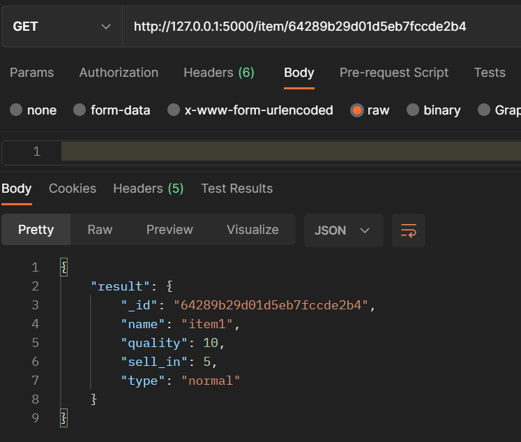

#### /get_inventory

Muestra todos los items en el inventario que se guarda en memoria.

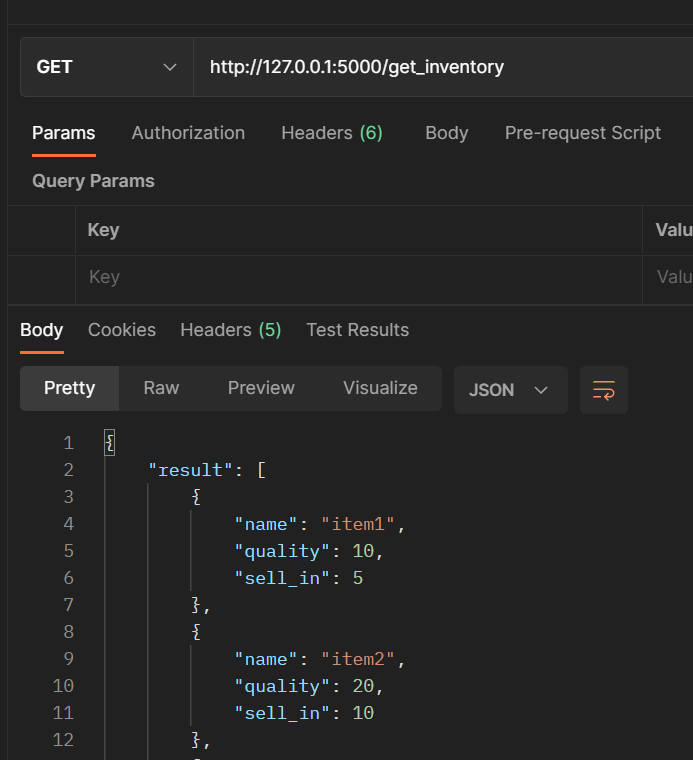

#### /item/ + <id>

Muestra información sobre el item con el id dado.

#### /add_items

Se crea un item con la información proporcionada.

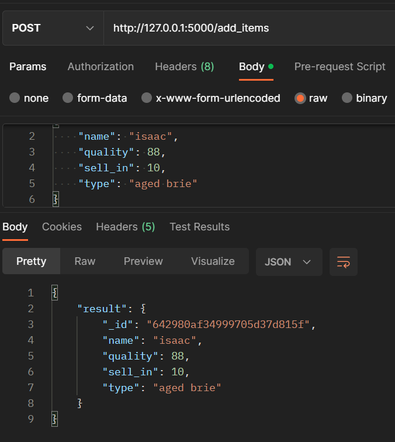

#### /inicializar

Se añaden datos a la base de datos para realizar pruebas

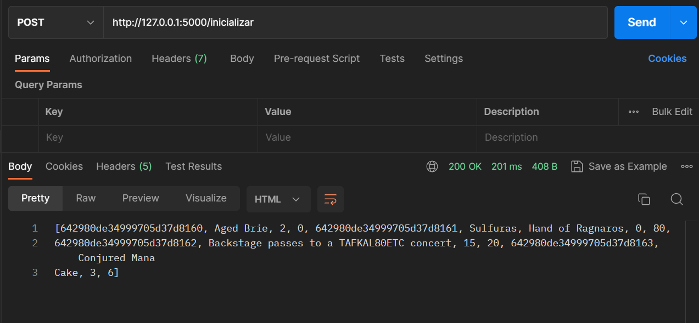

#### /delete_item

Se borra el item con el id proporcionado, devuelve el número de items borrados.

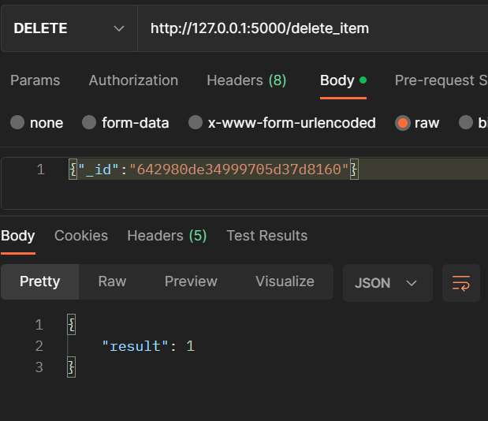

#### /delete_many 

Borra los items que coincidan con el tipo proporcionado.

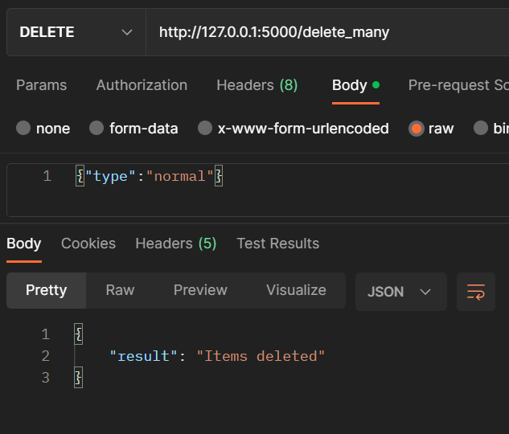

#### /update_inventory

Actualiza el sell_in y la quality de todos los productos.

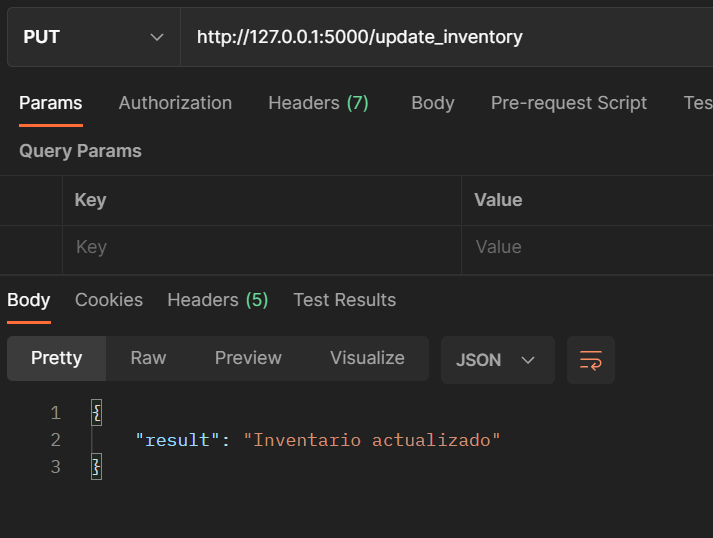

#### /update_item

Actualiza los datos de un item, se debe proporcionar el _id.

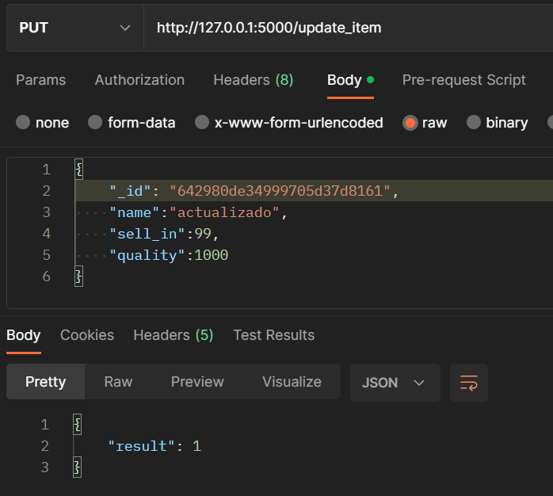

### Navegador

Se hicieron 3 endpoints para poder gestionar items desde el navegador:

#### form/all_items

Muestra todos los items en una tabla.

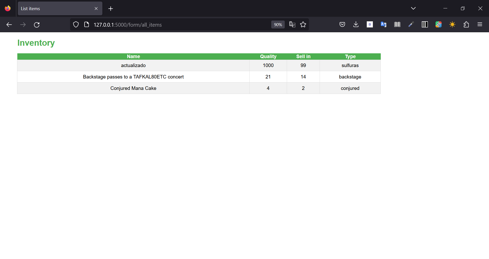

#### form/create

Crea un item con los datos proporcionados.

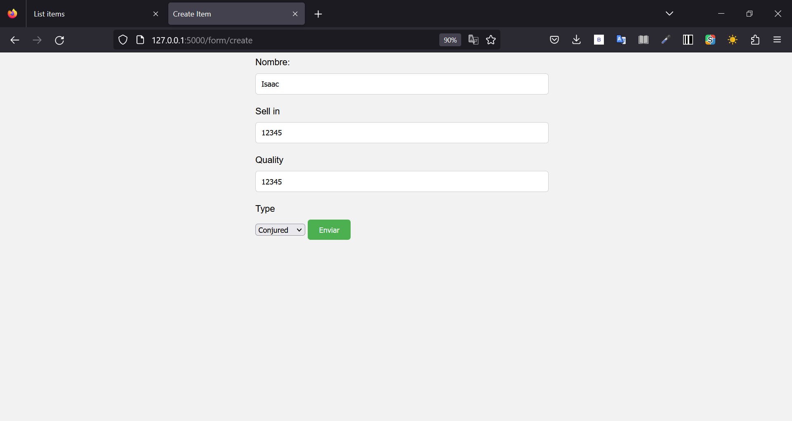

#### form/update

Actualiza un item.
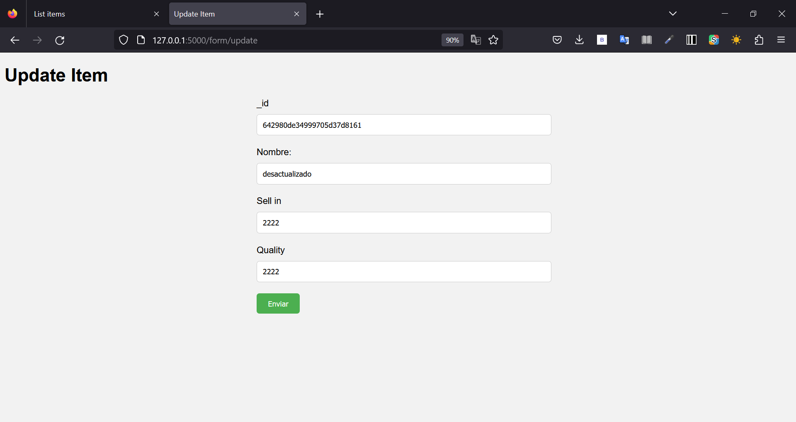
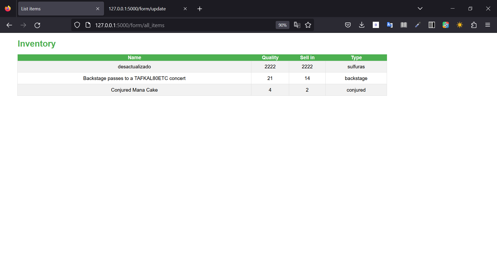

## Test

Para los test utilicé pytest. Logré un coverage de 88% porque los formularios de la web no son testeados.

### Coverage
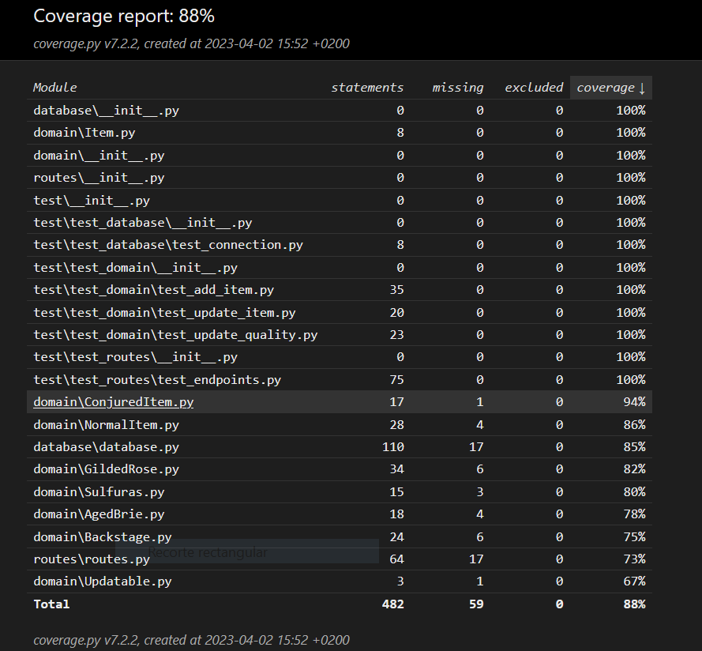

## Información adicional

### Dificultades

En la realización de este proyecto me encontré con las siguientes dificultades:

- Entender el funcionamiento de Flask me costó un poco al principio, la primera semana estuve bastante abrumado, después conseguí entender cómo funcionaba y fue todo bastante fluido.

- Problemas con Docker. Me dio muchos problemas, mi ordenador no detectaba la IP del contenedor y no creaba ningún tipo de conexión, al principio pensé que eran problemas de configuración de Docker, lo probé un Ubuntu y tampoco funcionaba. Finalmente, con la ayuda de los compañeros, vi que era simplemente porque en el Dockerfile, en vez de poner `flask run` debía poner `python /app.py`. Fue lo que más tiempo me llevó.

### Futuras mejoras

- Arreglar la estructura de directorios, no creo que sea la correcta.
- Mejorar la lógica de la base de datos.
- Intentar crear un modelo.
- Que se pueda navegar por la web.
- Hacer llamadas a la API con JS en vez de usar templates de Jinja2.

